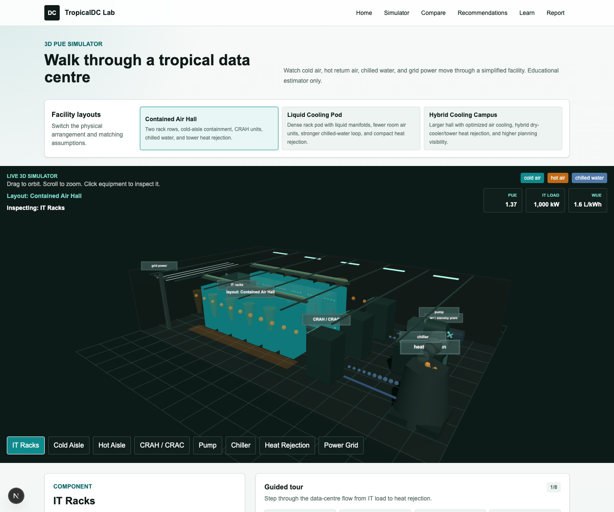

# TropicalDC Lab



TropicalDC Lab is an interactive 3D web simulator for exploring energy, water, and carbon trade-offs in tropical data centres. Users can orbit a simplified data-centre room, watch animated cold air, hot return air, chilled water, and grid power paths, click equipment, and adjust operating assumptions to see how decisions affect PUE, WUE, and estimated annual emissions.

This project is an educational estimator and portfolio project focused on the intersection of mechanical engineering, sustainable infrastructure, and software engineering.

## Why It Matters

Singapore-like tropical operating conditions make data-centre cooling harder. High humidity and warm ambient temperatures reduce free-cooling opportunities, so facility teams need clear ways to reason about chiller performance, airflow, water use, carbon intensity, and reliability trade-offs.

## Features

- Interactive 3D PUE simulator with orbit, zoom, guided equipment focus, animated flows, and selectable cooling assumptions.
- Viewable facility layouts: contained air hall, high-density liquid-cooling pod, and hybrid cooling campus.
- Clickable 3D equipment for racks, aisles, CRAH/CRAC, pumps, chillers, heat rejection, and grid power.
- Guided tour mode that steps through the data-centre flow from IT racks to grid power.
- Parameter-driven 3D geometry for rack density, liquid cooling equipment, and redundancy level.
- Live metric cards for IT load, facility overhead, PUE, WUE, annual energy, carbon, and water.
- Scenario comparison for baseline air cooling, optimized tropical air cooling, and liquid-cooling-assisted designs.
- Rule-based recommendations for efficiency, water, high-density racks, and redundancy trade-offs.
- Learning mode for data-centre sustainability basics.
- Print-friendly report page for browser PDF export.

## Tech Stack

- Next.js 16
- React 19
- TypeScript
- Tailwind CSS
- Recharts
- Three.js
- Vitest
- Playwright

## Calculation Methodology

The MVP uses a transparent simplified model:

```text
PUE = Total Facility Power / IT Equipment Power
Total Facility Power = IT Power + Cooling Power + Fan Power + Pump Power + Other Facility Power
Cooling Power = IT Load / Chiller COP x cooling factor x climate factor x wet-bulb modifier
Annual Energy = Total Facility Power x Operating Hours
Annual Carbon = Annual Energy x Grid Emissions Factor
Annual Water = IT Load x Operating Hours x heat-rejection water factor
WUE = Annual Water / Annual IT Energy
```

The calculation layer is covered by unit tests in `tests/calculations.test.ts`.

## Assumptions And Limitations

TropicalDC Lab is an educational simulator. Calculations are simplified and should not be used as a substitute for professional engineering analysis, certified Green Mark assessment, or official data-centre design work.

The model intentionally avoids detailed psychrometrics, chiller sequencing, control-loop behavior, redundancy load diversity, CapEx, and real DCIM or IoT data integration in the MVP.

## Run Locally

```bash
npm install
npm run dev
```

Open `http://localhost:3000`.

## Test

```bash
npm test
npm run lint
npm run build
npm run test:e2e
```

If Playwright browsers are missing:

```bash
npx playwright install chromium
```

## Roadmap

- Saved scenarios and shareable URLs.
- CSV and real PDF export.
- Cost and ROI modeling for efficiency upgrades.
- More detailed chiller plant and heat rejection model.
- Mock IoT stream and maintenance degradation simulation.
- AI-assisted explanation of recommendations.

## Disclaimer

TropicalDC Lab is an educational estimator, not a certified engineering design, audit, Green Mark scoring, or compliance tool.
